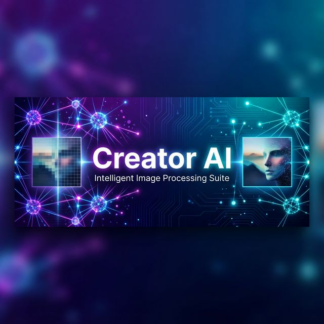

<p align="center">
  
</p>

<p align="center">
  <b>A professional-grade AI image processing suite powered by 12+ state-of-the-art deep learning models.</b>
</p>

<p align="center">
  
  
  
  
  
</p>

---

## 🎯 What is Creator AI?

**Creator AI** is an intelligent image processing platform that combines **12+ deep learning models** into a unified, interactive dashboard. Instead of running each AI model separately, Creator AI orchestrates them through **smart adaptive pipelines** that automatically analyze your image and activate only the models that are needed.

### The Problem
Traditional AI image tools either:
- Run a single model (limited quality)
- Run everything blindly (slow, wastes GPU)
- Require command-line expertise

### The Solution
Creator AI provides a **one-click Streamlit dashboard** with 5 professional tools, each backed by multi-stage AI pipelines that **dynamically route** processing based on image quality analysis.

---

## ✨ Features

| Tool | What It Does | AI Models Used |
|------|-------------|----------------|
| 🔍 **Super Resolution** | Upscale images 2x–4x with smart quality analysis | RealESRGAN, CodeFormer, SwinIR, Stable Diffusion |
| 🔤 **Text Removal** | Detect and erase text from any image | CRAFT, SAM, LaMa, Stable Diffusion Inpainting |
| 🎨 **Color Correction** | Fix exposure, white balance, and color grading | Zero-DCE, Restormer |
| ✂️ **Object Removal** | Remove objects using natural language prompts | GroundingDINO, YOLOv8, SAM, LaMa, MiDaS |
| 🖼️ **Background Removal** | Adaptive 5-stage background removal | BiRefNet, SAM, MODNet |

---

## 🏗️ Architecture

### System Overview

```
┌───────────────────────────────────────────────────────────────┐
│                    Streamlit Dashboard                         │
│               (ai_image_dashboard/app/)                       │
├───────────────────────────────────────────────────────────────┤
│                   Pipeline Wrappers                           │
│             (ai_image_dashboard/pipelines/)                   │
├──────────┬──────────┬──────────┬──────────┬──────────────────┤
│  Super   │   Text   │  Color   │  Object  │   Background    │
│Resolution│ Removal  │Correction│ Removal  │    Removal      │
├──────────┴──────────┴──────────┴──────────┴──────────────────┤
│                    Shared Utilities                           │
│           (shared/logging_config, image_utils)                │
├──────────────────────────────────────────────────────────────┤
│               Model Weights (weights/)                       │
│          libs/ (CodeFormer, BasicSR architectures)           │
└──────────────────────────────────────────────────────────────┘
```

### Project Structure

```
Creator AI/
│
├── src/
│   ├── ai_image_dashboard/          # 🖥️  Streamlit UI Layer
│   │   ├── app/
│   │   │   ├── streamlit_app.py     # Main dashboard (750+ lines)
│   │   │   └── config.py            # UI configuration
│   │   ├── pipelines/               # Thin wrappers connecting UI → engines
│   │   │   ├── super_resolution_pipeline.py
│   │   │   ├── text_removal_pipeline.py
│   │   │   ├── color_pipeline.py
│   │   │   ├── object_pipeline.py
│   │   │   └── background_pipeline.py
│   │   └── utils/
│   │       └── image_utils.py
│   │
│   ├── ai_super_resolution/         # 🔍 Smart Adaptive SR Engine
│   │   ├── sr_pipeline.py           # 10-stage orchestrator with quality analysis
│   │   ├── stages/
│   │   │   ├── quality_analyzer.py  # Image quality metrics (blur/noise/detail/face)
│   │   │   ├── input_validator.py   # Smart resize & validation
│   │   │   ├── denoiser.py          # Edge-preserving denoising
│   │   │   ├── tile_engine.py       # Overlapping tile split/fuse with Gaussian blending
│   │   │   ├── color_matcher.py     # LAB histogram matching
│   │   │   └── post_processor.py    # Adaptive unsharp mask
│   │   ├── models/
│   │   │   ├── upsampler.py         # RealESRGAN (via spandrel)
│   │   │   ├── codeformer_enhancer.py # CodeFormer face restoration
│   │   │   ├── swinir_refiner.py    # SwinIR transformer refinement
│   │   │   └── diffusion_refiner.py # Stable Diffusion x4 upscaler
│   │   └── configs/
│   │       └── config.yaml          # Pipeline configuration & quality thresholds
│   │
│   ├── ai_text_removal/             # 🔤 Text Detection & Inpainting Engine
│   │   ├── tr_pipeline.py           # Multi-stage text removal orchestrator
│   │   ├── tr_pipelines/
│   │   │   ├── detect_text.py       # CRAFT text detection
│   │   │   ├── segment_mask.py      # SAM mask segmentation
│   │   │   ├── refine_mask.py       # Morphological mask refinement
│   │   │   ├── inpaint.py           # LaMa inpainting
│   │   │   ├── diffusion_refine.py  # SD inpainting refinement
│   │   │   └── post_process.py      # Seam blending & cleanup
│   │   └── configs/
│   │       └── config.yaml
│   │
│   ├── background_removal/          # 🖼️ Adaptive Background Removal Engine
│   │   ├── inference/
│   │   │   └── engine.py            # 5-stage adaptive orchestrator
│   │   ├── bg_pipeline/
│   │   │   ├── scene_analyzer.py    # Scene complexity detection
│   │   │   ├── salient_detection.py # BiRefNet salient object detection
│   │   │   ├── segmentation.py      # SAM instance segmentation
│   │   │   ├── matting.py           # MODNet alpha matting
│   │   │   ├── preprocessing.py     # Input normalization
│   │   │   └── postprocessing.py    # Edge refinement & compositing
│   │   ├── bg_models/
│   │   │   ├── sod/                 # BiRefNet model
│   │   │   ├── sam/                 # SAM model
│   │   │   └── modnet/              # MODNet model + MobileNetV2 arch
│   │   └── configs/
│   │
│   ├── hybrid_color_correction/     # 🎨 Color & Exposure Correction Engine
│   │   ├── hc_pipeline/
│   │   │   ├── enhance.py           # Zero-DCE + Restormer pipeline
│   │   │   ├── preprocess.py        # Color space conversion
│   │   │   └── postprocess.py       # Tone mapping
│   │   └── hc_models/
│   │       ├── zero_dce/            # Zero-DCE light enhancement
│   │       └── restormer/           # Restormer detail recovery
│   │
│   ├── object_removal_ai/           # ✂️ Object Removal Engine
│   │   ├── main_pipeline.py         # Multi-model orchestrator
│   │   ├── models/
│   │   │   ├── groundingdino_detector.py  # Text-guided detection
│   │   │   ├── yolo_detector.py     # YOLOv8 fallback detection
│   │   │   ├── sam_segmenter.py     # SAM mask generation
│   │   │   ├── lama_inpainter.py    # LaMa inpainting
│   │   │   ├── midas_depth.py       # Depth estimation
│   │   │   └── diffusion_refiner.py # SD inpainting refinement
│   │   └── or_pipeline/
│   │       ├── mask_refiner.py      # Multi-stage mask refinement
│   │       ├── context_expansion.py # Inpainting context window
│   │       └── postprocess.py       # Seam removal & blending
│   │
│   └── shared/                      # 🔧 Shared Utilities
│       ├── logging_config.py        # Centralized structured logging
│       └── image_utils.py           # Common image operations
│
├── libs/                            # 📦 Local Model Architectures
│   ├── CodeFormer/                  # CodeFormer network definitions
│   └── BasicSR/                     # Basic image restoration utilities
│
├── weights/                         # ⚖️ Model Weights (auto-downloaded)
├── tests/                           # 🧪 Test Suite
├── assets/                          # 🎨 Project assets
├── requirements.txt                 # 📋 Python dependencies
├── Dockerfile                       # 🐳 Container deployment
├── download_weights.py              # ⬇️ Weight download utility
└── .gitignore
```

> **110 Python files · 8,700+ lines of code · 12+ AI models**

---

## 🔍 Deep Dive: Super Resolution Pipeline

The flagship feature uses a **smart adaptive architecture** that dynamically selects which AI models to run based on image quality analysis.

### How It Works

```
Input Image (e.g. 1024×1024)
        │
        ▼
┌─────────────────────┐
│  Quality Analyzer    │  ← Runs in <100ms on CPU
│  • blur_score        │     Uses Laplacian variance, Canny edges,
│  • noise_level       │     Gaussian difference, RetinaFace
│  • detail_score      │
│  • face_detected     │
└────────┬────────────┘
         │
         ▼
┌─────────────────────┐
│  Conditional Router  │  ← Decides which models to activate
│                      │
│  if noise > 0.6:     │     ✅ Denoise
│  if face_detected:   │     ✅ CodeFormer
│  if detail < 0.5:    │     ✅ SwinIR (Balanced/HD only)
│  if blur > 0.7:      │     ✅ Diffusion (HD only)
└────────┬────────────┘
         │
         ▼
┌─────────────────────────────────────────────┐
│  RealESRGAN (4x Upscale)                    │
│  Tiled: 512×512 with 64px overlap           │
│  Gaussian-weighted seamless fusion          │
└────────┬────────────────────────────────────┘
         │
         ▼ (if face detected)
┌─────────────────────────────────────────────┐
│  CodeFormer Face Restoration                │
│  Identity-preserving face enhancement       │
│  fidelity_weight=0.7 for natural look       │
└────────┬────────────────────────────────────┘
         │
         ▼ (if detail is low — Balanced/HD)
┌─────────────────────────────────────────────┐
│  SwinIR Transformer Refinement              │
│  Recovers fine textures (skin, fabric)      │
│  FP16 autocast for 2x speed                │
└────────┬────────────────────────────────────┘
         │
         ▼ (if extremely degraded — HD only)
┌─────────────────────────────────────────────┐
│  Stable Diffusion x4 Upscaler               │
│  Generates photorealistic textures          │
│  Tiled inference to prevent OOM             │
└────────┬────────────────────────────────────┘
         │
         ▼
┌─────────────────────────────────────────────┐
│  Color Matching (LAB histogram) + Sharpening│
└────────┬────────────────────────────────────┘
         │
         ▼
    Output Image (4096×4096)
```

### Performance Modes

| Mode | Modules Activated | Speed | Quality |
|------|------------------|-------|---------|
| ⚡ **Fast** | RealESRGAN + CodeFormer (auto) + Sharpen | ~15s | ★★★☆☆ |
| ⚖️ **Balanced** | + SwinIR (if detail is low) | ~45s | ★★★★☆ |
| 🎨 **HD** | + SwinIR + Diffusion (if degraded) | ~3min | ★★★★★ |

> **Key Innovation:** Unlike traditional upscalers that blindly run all models, Creator AI's Quality Analyzer inspects the image first and skips unnecessary stages. A clean, sharp portrait in Fast mode completes in **15 seconds** instead of 3 minutes.

---

## 🖼️ Other Pipelines

### Text Removal
Detects text regions using **CRAFT** (Character Region Awareness for Text), segments precise masks with **SAM**, and fills the regions using **LaMa** inpainting with optional **Stable Diffusion** refinement. Includes morphological mask expansion and seam blending for invisible repairs.

### Object Removal
Accepts **natural language prompts** (e.g., "remove the car") via **GroundingDINO** text-guided detection, with **YOLOv8** as a fallback. Masks are refined through multi-stage dilation/erosion, and inpainting uses **LaMa** with **MiDaS** depth-aware context for realistic results.

### Color Correction
Combines **Zero-DCE** (Zero-Reference Deep Curve Estimation) for exposure correction with **Restormer** for detail recovery. Processes images through a preprocess → enhance → postprocess pipeline with LAB color space normalization.

### Background Removal
A 5-stage adaptive engine that analyzes scene complexity to select the optimal model combination:
- **Simple scenes** (portraits): MODNet alpha matting for fast, clean edges
- **Complex scenes** (products, multi-object): BiRefNet + SAM segmentation
- Includes trimap generation, edge refinement, and alpha compositing

---

## 🧠 Memory Management

Creator AI is designed to run on **consumer GPUs with as little as 4GB VRAM** (e.g., RTX 3050):

| Technique | Description |
|-----------|-------------|
| **Sequential Model Loading** | Only one heavy model in VRAM at a time |
| **Tiled Inference** | 512×512 overlapping tiles for large images |
| **FP16 Autocast** | Halves activation memory on RTX cards |
| **CPU Offloading** | Large tensors kept on CPU, only tiles sent to GPU |
| **Lazy Loading** | Stable Diffusion loads only when needed |
| **Aggressive Cleanup** | `torch.cuda.empty_cache()` + `gc.collect()` between stages |

---

## 🚀 Getting Started

### Prerequisites

- **Python** 3.10 or higher
- **NVIDIA GPU** with 4GB+ VRAM and CUDA 12.x
- **16GB+ System RAM** (recommended)

### Installation

```bash
# 1. Clone the repository
git clone https://github.com/yourusername/creator-ai.git
cd creator-ai

# 2. Create and activate virtual environment
python -m venv venv

# Windows
venv\Scripts\activate

# Linux/macOS
source venv/bin/activate

# 3. Install PyTorch with CUDA support
pip install torch torchvision --index-url https://download.pytorch.org/whl/cu124

# 4. Install dependencies
pip install -r requirements.txt

# 5. Download model weights (auto-downloads on first use, or pre-download)
python download_weights.py
```

### Launch the Dashboard

```bash
cd src/ai_image_dashboard
python -m streamlit run app/streamlit_app.py
```

The dashboard will open at `http://localhost:8501`.

### Docker Deployment

```bash
docker build -t creator-ai .
docker run --gpus all -p 8501:8501 creator-ai
```

---

## ⚙️ Configuration

All pipeline settings are controlled via YAML configuration files:

```yaml
# src/ai_super_resolution/configs/config.yaml

pipeline:
  device: "cuda"
  image_size_limit: 4096

modules:
  quality_analysis:
    blur_threshold: 0.7      # Above → activates Diffusion
    detail_threshold: 0.5    # Below → activates SwinIR
    noise_threshold: 0.6     # Above → activates denoiser

  face_enhancement:
    fidelity_weight: 0.7     # 0.0 = max quality, 1.0 = max identity

  swinir_refinement:
    tile_size: 512            # Larger = more VRAM, faster

  diffusion_refinement:
    num_inference_steps: 20   # 20 = fast, 50 = max quality
    guidance_scale: 4.0       # 4.0 = subtle, 7.5 = strong
```

---

## 🧪 Testing

```bash
# Run the test suite
python -m pytest tests/ -v

# Quick smoke test for SR pipeline
python -c "
from ai_super_resolution.sr_pipeline import SuperResolutionPipeline
import yaml, numpy as np

config = yaml.safe_load(open('src/ai_super_resolution/configs/config.yaml'))
pipeline = SuperResolutionPipeline(config)

# Test with a random image
test_img = np.random.randint(0, 255, (256, 256, 3), dtype=np.uint8)
result = pipeline.run(test_img, scale=2, mode='fast')
print(f'Input: 256x256 → Output: {result.shape[1]}x{result.shape[0]}')
"
```

---

## 📊 Technical Specifications

| Component | Details |
|-----------|---------|
| **Language** | Python 3.10+ |
| **Framework** | PyTorch 2.0+ |
| **UI** | Streamlit |
| **Codebase** | 110 files · 8,700+ lines |
| **AI Models** | 12+ (RealESRGAN, CodeFormer, SwinIR, SD, CRAFT, SAM, LaMa, GroundingDINO, YOLOv8, MiDaS, BiRefNet, MODNet, Zero-DCE, Restormer) |
| **Min GPU** | 4GB VRAM (RTX 3050) |
| **Max Output** | 8K resolution (8192×8192) |
| **Inference** | Tiled, FP16, sequential model loading |
| **Logging** | Structured Python logging |

---

## 🗺️ Roadmap

- [ ] Batch processing support
- [ ] API endpoint (FastAPI)
- [ ] Video super-resolution
- [ ] Custom model fine-tuning interface
- [ ] Cloud deployment (AWS/GCP)
- [ ] Plugin system for custom pipelines

---

## 📄 License

This project is proprietary. All rights reserved.

---

<p align="center">
  Built with ❤️ using PyTorch, Streamlit, and 12+ state-of-the-art AI models
</p>
